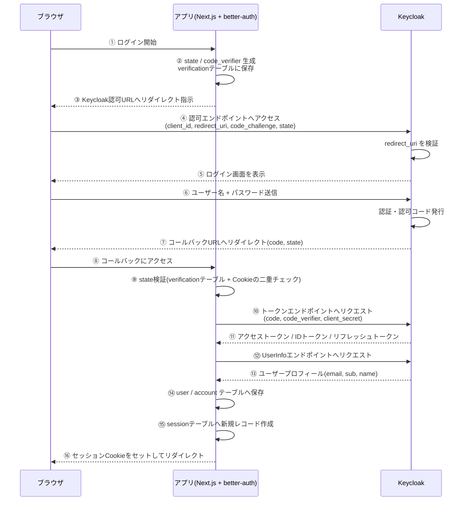

# 認証の仕組み(Keycloak + better-auth, Authorization Code Flow with PKCE)

Keycloak(OIDCプロバイダ/IdP)とbetter-auth(認証ライブラリ)を組み合わせて、Next.jsアプリにログイン・ログアウトを実装する場合の仕組みを整理する。

## 登場人物

| 登場人物 | 役割 |
|---|---|
| ブラウザ | エンドユーザーの操作端末 |
| アプリサーバー | Next.jsのサーバーサイド。better-authの`auth`インスタンスを持つ。confidential client(`client_secret`を保持) |
| better-authの内部ルーター | アプリサーバー内で、リクエストのパス・メソッドから実際に処理すべき機能を振り分ける |
| Keycloak | OIDCプロバイダ(IdP)。realmの下にClientを登録し、ユーザー認証・トークン発行を行う |

## 前提となるKeycloak Client設定

- Client authentication: ON(confidential client。`client_secret`を持たせる)
- Standard flow(Authorization Code Flow): ON
- PKCE: S256
- Valid redirect URIs: ログイン成功後にKeycloakが認可コードを返してよい戻り先のホワイトリスト。アプリが指定した`redirect_uri`がここに登録されたものと一致しない場合、Keycloakはリダイレクト自体を拒否する(認可コード横取り攻撃を防ぐため)
- Valid post logout redirect URIs: ログアウト後にKeycloakが戻ってよい戻り先のホワイトリスト(考え方はValid redirect URIsと同じ)

## better-authのルーティングの仕組み

better-authは、コア機能やプラグイン(`genericOAuth`など)が持つ全エンドポイントを、起動時に自身の内部ルーターへ「このHTTPメソッド+このパスパターンならこの処理」という形で登録しておく。リクエストが来るたびに、URLからbetter-authをマウントしている接頭辞(例: `/api/auth`)を除いた残りのパスとHTTPメソッドの組み合わせで、登録済みのルートを検索する。動的セグメント(`:providerId`など)もここで解決される。

アプリ側がフレームワークのルーティング機構(Next.jsのRoute Handlerなど)でこのマウントポイントを1つ用意し、その配下に来るリクエストを丸ごとbetter-authに渡す。実際に「これはサインインの処理だ」「これはコールバックの処理だ」と判断する実体は、フレームワーク側ではなくbetter-auth自身の内部ルーターが持っている。

## ログインフローの全体図

## ログインフロー(詳細)

0. **[ブラウザ]** ユーザーがログインを開始する

1. **[ブラウザ→アプリ]** アプリがKeycloakへのサインインを開始する(内部的には`POST .../sign-in/oauth2`相当の処理)

2. **[アプリ]** better-authがサインイン処理を実行
   - ランダムな`state`(CSRF対策の合言葉)と`code_verifier`(PKCE用)を生成
   - `code_verifier`のSHA256ハッシュ`code_challenge`を計算
   - `state`をキーに、`code_verifier`・`callbackURL`などを**`verification`テーブル**に保存する(引換券を発行するイメージ)
   - Keycloakの`.well-known/openid-configuration`(Discovery)にアクセスし、実際の認可エンドポイント・トークンエンドポイントのURLを動的に取得する
   - Keycloakの認可エンドポイントURL(`client_id`, `redirect_uri`, `code_challenge`, `code_challenge_method=S256`, `state`などを含む)を組み立てる

3. **[アプリ→ブラウザ]** 組み立てたURLへブラウザをリダイレクトさせる。**ここで初めて実際にKeycloakへ移動する**

4. **[Keycloak]** リクエストの`redirect_uri`が、Clientに登録した`Valid redirect URIs`と一致するかチェック。不一致ならここでエラーになり先に進まない

5. **[ブラウザ⇔Keycloak]** ログイン画面が表示され、ユーザーがユーザー名+パスワードを入力。Keycloakが検証する(アプリはこの入力内容を一切見ない)

6. **[Keycloak→ブラウザ]** 認証成功後、認可コードを`code_challenge`と紐づけて一時保存し、HTTPの302リダイレクトでアプリのコールバックURLにブラウザを送る。ブラウザがこれをたどるため`GET`リクエストになる

7. **[ブラウザ→アプリ]** ブラウザがコールバックURLにアクセスする。ここから先、アプリ側では以下の処理が順番に走る

8. **[アプリ] エラーチェック・プロバイダ特定**
   - クエリに`error`が含まれる、または`code`が無い場合は即座にエラー画面へ
   - URLの`:providerId`から、登録済みのプロバイダ設定(`keycloak`)を検索

9. **[アプリ] `state`の検証(`verification`テーブルの参照)**
   - クエリの`state`値をキーに、**`verification`テーブルから該当レコードを検索**。見つからなければ`state mismatch`
   - 見つかったデータの中の`oauthState`と、渡された`state`が一致するか照合
   - **さらに、ブラウザから送られてきた署名付きCookie(`state`という名前)の値とも一致するか照合**(二重チェック)。不一致なら`state_security_mismatch`
   - 有効期限も確認。すべて通れば、保存しておいた`codeVerifier`・`callbackURL`を取り出す

10. **[アプリ] Discoveryの再取得**
    サインイン時と同様に、Keycloakの`.well-known/openid-configuration`にもう一度アクセスし、`token_endpoint`・`userinfo_endpoint`を取得する(サインイン時の結果は使い回されない)

11. **[アプリ→Keycloak] トークンエンドポイントへの実リクエスト**
    ステップ10で取得した`token_endpoint`に対して、**サーバー間の実HTTPリクエスト(ブラウザを介さない)**を送る
    - `grant_type=authorization_code`
    - `code`(受け取った認可コード)
    - `code_verifier`(ステップ9で`verification`テーブルから復元した値。PKCE)
    - `client_id` / `client_secret`(confidential clientの証明)
    - `redirect_uri`(照合用に再送)

12. **[Keycloak]** 以下を検証してトークンを発行
    - `client_id`/`client_secret`が正しいか
    - `code_verifier`のハッシュが、ステップ2で送った`code_challenge`と一致するか(PKCE検証)
    - 認可コードが未使用・有効期限内か
    すべて通れば、アクセストークン・IDトークン・リフレッシュトークンを返す

13. **[アプリ→Keycloak] UserInfoエンドポイントへの問い合わせ**
    取得したアクセストークンを使い、`userinfo_endpoint`に対して**別のHTTPリクエスト**を送り、ユーザーのプロフィール情報(`email`, `sub`, `name`など)を取得する(IDトークンをその場でデコードするのではなく、この方式でユーザー情報を得る)。`email`・`sub`(ID)・`name`が揃っているか検証し、揃っていなければエラー

14. **[アプリ] `user`・`account`テーブルへの保存**
    - `user`テーブル: ユーザー情報(初回なら新規作成、既存なら特定)
    - `account`テーブル: Keycloakから受け取ったトークン一式(`accessToken`, `refreshToken`, `idToken`)

15. **[アプリ→ブラウザ] セッションCookie発行**
    `session`テーブルに新しいレコードを作り、その`token`をHttpOnly・SecureなCookieとしてブラウザにセットする

16. **[アプリ→ブラウザ] 最終リダイレクト**
    ステップ9で`verification`テーブルから復元しておいた`callbackURL`(今回は`"/"`)へブラウザをリダイレクトし、一連の処理が完了する

17. **[ブラウザ→アプリ]** 以降のリクエストでは、ブラウザは毎回このセッションCookieを送るだけ。アプリはCookieの値をDBのセッション情報と照合してユーザーを特定する。Keycloakの生トークンはずっとアプリのサーバー側に留まったまま、ブラウザには一切渡らない

## PKCEの仕組み

PKCE(Proof Key for Code Exchange、RFC 7636)は、OAuth 2.0の標準拡張。**認可コードを途中で横取りされても、それだけでは悪用できないようにするための仕組み**。

**なぜ必要か:** Authorization Code Flowでは、認可コードはブラウザのリダイレクトを経由してアプリに届く。この経路上でコードが漏洩・横取りされるリスクがある。PKCEは、コードをトークンに交換する最終段階で「コードを要求したのと同じクライアントであること」を証明させることで、コードだけを盗んでもトークンに交換できないようにする。

**仕組み:**
1. 認可リクエストを送る**前**に、ランダムな文字列`code_verifier`をアプリのサーバー側で生成する
2. `code_verifier`のSHA256ハッシュを計算し、Base64URLエンコードしたものを`code_challenge`とする
3. 認可リクエスト(ステップ2〜4)には`code_challenge`とハッシュ方式(`code_challenge_method=S256`)**だけ**を含める。`code_verifier`自体はこの時点では一切送信しない
4. Keycloakは`code_challenge`を、発行する認可コードと紐づけて保存する
5. トークン交換時(ステップ11、アプリ→Keycloakのサーバー間通信)に、今度は元の`code_verifier`を送る
6. Keycloakは受け取った`code_verifier`のSHA256ハッシュを計算し、ステップ4で保存しておいた`code_challenge`と一致するか確認する。一致すれば初めてトークンを発行する

**なぜこれで安全になるか:** 仮に認可コードだけを盗んでも、攻撃者は`code_verifier`(一度もネットワーク上に平文で流れておらず、アプリのサーバー内にしか存在しない値)を知らないため、トークン交換の段階で弾かれる。confidential client(`client_secret`を持つ)であっても、`client_secret`とは別軸の防御としてPKCEを併用することが、近年のベストプラクティス(OAuth 2.1)として推奨されている。

## `state`検証の仕組み

`state`は「Keycloakが認可コードを発行するために使うもの」ではない。**アプリが、後でKeycloakから返ってきたレスポンスが本当に自分が開始したリクエストへの返答かを確認するための、CSRF対策の使い捨てトークン**である。Keycloakは`state`の中身を一切解釈せず、預かって右から左にそのまま返すだけの「荷札」として扱う。

信頼性を高めるため、`state`はDB(`verification`テーブル)とCookie(ブラウザ側)の**2箇所に保存**され、コールバック時に両方が一致するかを照合する設計になっている。一致しない(またはCookie自体が存在しない)場合は、`state`不一致のエラーとして処理が中断される。

## ログアウトフロー

「ログアウト」で必ずやるべきことは2つある。

1. **アプリ側のローカルログアウト**: アプリが発行したセッションレコードの削除+セッションCookieの削除
2. **Keycloak側のセッション終了**: Keycloak自身が持つセッション(ブラウザとKeycloak間のログイン状態)を終了させないと、ユーザーが再度ログインを試みた際にKeycloakが「ログイン済み」と判定し、パスワード入力なしで即座に再ログインしてしまう(SSOの仕組みがそのまま働くため)。ローカルログアウトだけでは「アプリからは見えなくなるが、Keycloak上はログインしたまま」という状態になり得る

**フロー**

0. **[ブラウザ]** ユーザーがログアウトを開始する

1. **[アプリ]** 現在のセッションを確認し、そのユーザーに紐づくKeycloakのIDトークンを取得する

2. **[アプリ]** アプリ側のセッションレコードを削除し、セッションCookieを削除する(ローカルログアウト完了)

3. **[アプリ]** Keycloakのend session(RP-Initiated Logout)エンドポイントのURLを組み立てる。パラメータとして`id_token_hint`(手順1で取得したIDトークン。どのセッションを終了すべきかKeycloakに伝える)と`post_logout_redirect_uri`(ログアウト後の戻り先)を付与する

4. **[アプリ→ブラウザ]** そのURLへブラウザをリダイレクトさせる

5. **[Keycloak]** `id_token_hint`でセッションを特定し、`post_logout_redirect_uri`が`Valid post logout redirect URIs`に登録されたものと一致するか確認した上で、Keycloak自身のセッションを終了させる

6. **[Keycloak→ブラウザ]** `post_logout_redirect_uri`で指定したURLへリダイレクト。ここで完全ログアウト完了

## ポイント

- `state`はKeycloakのためではなく、アプリ自身が「後で返ってきたレスポンスが本物か」を確認するためのCSRF対策トークン
- PKCEは、認可コード横取り攻撃に対する、`client_secret`とは別軸の多層防御
- ブラウザが最終的に持つのは**アプリ独自のセッションCookie**であり、Keycloakの生トークン(IDトークン/アクセストークン)そのものではない
- 認可コードの交換・UserInfoの取得・ログアウト時のIDトークン取得は常にサーバー間通信・サーバー内処理で行われ、ブラウザは関与しない
- ユーザー情報の取得はIDトークンのデコードではなく、UserInfoエンドポイントへの追加のHTTPリクエストによって行われる
- ローカルログアウトとKeycloak側のセッション終了は別物であり、完全なログアウトには両方が必要
- Next.jsでこの仕組みを実装する場合、Cookieの書き込みはServer ActionかRoute Handlerの中でしか許可されない点に注意が必要(通常のページ/Server Componentの中では書き込めない)
