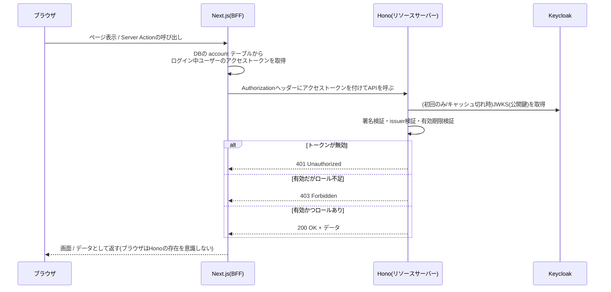

# バックエンド(Hono)によるリソースサーバーの実装

Keycloakが発行したアクセストークンを検証し、ロールに応じてAPIへのアクセスを制御する、軽量なバックエンド(Hono)の実装で押さえておくべきポイントを整理する。

## Honoとは

軽量なWebフレームワーク。Express等と役割は近いが、**特定のJSランタイムに縛られない設計**が特徴で、Node.js・Cloudflare Workers・Denoなど、どこでも同じコードで動くことを目指している。

- `new Hono()`: アプリケーション本体。ルート(経路)を登録していく
- `app.get(path, ...handlers)`: 指定したパス・メソッドへのリクエストを処理する。ハンドラーは複数並べられ、順番に実行される(後述のミドルウェア)
- `c`(コンテキスト): リクエストの中身を読んだり、レスポンスを組み立てたりするための道具箱。`c.req.header(...)`, `c.json(...)`, `c.set(...)`/`c.get(...)`など
- Hono自体はリクエストを受けてレスポンスを返す関数(`app.fetch`)を提供するだけで、実際にポートを開いて待ち受ける処理は持たない。Node.js上で動かす場合は`@hono/node-server`の`serve()`が、その橋渡しをする

## 設計方針: 「認証はしない、検証だけする」リソースサーバー

フロントエンド(Next.js)側は認証ライブラリ(better-auth)を持ち、Keycloakとの認可コードのやり取り・セッション管理を担う「認証の主」。それに対しHono側は、**認証の仕組みを一切持たず、渡されたアクセストークン(JWT)が本物かどうかを検証するだけ**の「リソースサーバー」として設計する。

この役割分担のメリット:
- Honoはステートレスになり、DBもセッション管理も不要(検証はKeycloakの公開鍵があればその場で完結する)
- 認証基盤(Keycloak/better-auth)が1箇所に集約され、複数のバックエンドサービスがあっても同じ検証ロジックを使い回せる
- Next.js(フロントエンド)側が、保存しておいたアクセストークンを`Authorization: Bearer <token>`として付けて呼び出すだけで連携できる

## BFF(Backend For Frontend)としてのNext.js

今回の構成では、**ブラウザは一度もHonoに直接アクセスしない**。Honoを呼び出すのは常にNext.jsのサーバー側(Server Component/Server Actionなど)であり、ブラウザはNext.jsに対してだけリクエストを送る。

```
ブラウザ → Next.js(BFF) → Hono(リソースサーバー)
```

Next.jsがこの「ブラウザとバックエンド群の間に立つ専用の窓口」という役割を果たしている状態を、BFF(Backend For Frontend)と呼ぶ。特定のフロントエンド(今回で言えばこのNext.jsアプリ)専用に、必要な情報を集約・変換・仲介するバックエンド層、という位置づけ。

**なぜこの形になっているか**

これは新しく導入した設計ではなく、`docs/auth-flow.md`で整理した「ブラウザには生のKeycloakトークンを渡さず、Next.js側にだけ保持しておく」という決定の**自然な帰結**である。Keycloakのアクセストークンは`account`テーブルにしか存在せず、ブラウザ側のJavaScriptからは触れない。したがって、そのトークンを使ってHonoを呼び出す処理も、必然的にトークンを持っているNext.jsのサーバー側でしか行えない。

**もしBFFにしなかったら(比較)**

仮にブラウザから直接Honoを呼ぶ設計にしていたら、ブラウザ側のJavaScriptがKeycloakのアクセストークンそのものを保持する必要があり、`docs/auth-flow.md`で避けたかった「生トークンをブラウザに渡す」状態に逆戻りしてしまう。BFFという構成は、今回のセキュリティ上の設計方針を維持したまま、複数のバックエンドサービス(Hono)を追加していくための、自然で必要な帰結と言える。

**BFFに乗る役割**

- ログイン中ユーザーのトークンを`account`テーブルから取り出す(トークンの保管場所を知っているのはNext.jsだけ)
- 必要に応じてトークンのリフレッシュを行う(有効期限が切れていれば、ブラウザを介さずNext.js側で更新できる)
- Honoへのリクエストを組み立て、`Authorization`ヘッダーを付けて呼び出す
- Honoからのレスポンスを、ブラウザに返す画面やデータの形に変換する

## JWT検証の仕組み(JWKS)

アクセストークンはJWT(JSON Web Token)形式で、`ヘッダー.ペイロード.署名`の3つがドットで連結された文字列。ヘッダーとペイロードはBase64URLエンコードされているだけで暗号化はされておらず、誰でもデコードして中身を読める(≠改ざんできない、ではない点に注意。**中身が見えることと、正当性が保証されることは別**)。

正当性を保証するのが署名検証で、これには発行者(Keycloak)の公開鍵が必要になる。KeycloakはこれをJWKS(JSON Web Key Set)という形式で、`{issuer}/protocol/openid-connect/certs`のようなエンドポイントから公開している。

検証で確認していること:
- 署名がKeycloakの秘密鍵で正しく署名されたものか(公開鍵で検証)
- `iss`(発行者)が期待するKeycloakのものと一致するか
- `exp`(有効期限)が切れていないか

これらの検証処理は自前で実装せず、`jose`のような実績のあるライブラリに任せる(JWKSの取得・キャッシュ・鍵のローテーション対応なども含めて、自前実装は事故りやすい領域)。

## ミドルウェアという仕組み

Honoにおけるミドルウェアは、**リクエストが実際のルート処理に届く前に割り込んで、共通のチェックを行う関数**。

```
app.get(path, requireAuth, requireRole("admin"), handler)
```

のように複数並べて書け、それぞれが`next()`を呼んで初めて次の処理に進む。`next()`を呼ばずにレスポンスを返せば、そこで処理は打ち切られる。「認証チェック」「認可チェック」「実際の処理」を別々の関数に分離できるので、複数のエンドポイントで使い回しやすい。

## 401と403の違い

似ているようで意味が異なる、2つのHTTPステータスコード。

| コード | 意味 | 今回の実装での例 |
|---|---|---|
| 401 Unauthorized | **そもそも誰か分からない**(未認証)。トークンが無い、壊れている、期限切れなど | `requireAuth`(認証チェック)で弾かれた場合 |
| 403 Forbidden | **誰かは分かるが、その人には権限が無い**(認証はできたが認可されない) | `requireRole`(認可チェック)で弾かれた場合 |

実際の開発でも、「ロールが無いから403になるはず」と予想していたのに401が返ってきて原因を調べたら「そもそもトークンが期限切れだった」ということがあった。**401が返ってきたら、まず認証(トークンの有効性)を疑い、403が返ってきたら認可(権限)を疑う**、という切り分けの指針になる。

## リクエストの流れ(全体図)



## Clean Architectureの適用

Hono側でも、Next.js側(`modules/auth`)と同じ考え方でレイヤーを分けた。

| レイヤー | 役割 |
|---|---|
| domain(entities) | トークンのペイロードの型、「ロールを持っているか」を判定する純粋なルール |
| domain(repositories) | 「トークンを検証すると、ペイロードが返ってくる」という輪郭だけを定義するinterface |
| infrastructure(repositories) | `jose`を使った、interfaceの具体的な実装(JWKS取得・署名検証) |
| application(usecases) | 「Authorizationヘッダーの文字列を受け取り、検証済みのペイロードかnullを返す」という手順。HTTPの知識を持たない |
| presentation(middleware) | Honoの`Context`からヘッダーを取り出し、application層を呼び、結果に応じて401/403というHTTP固有のレスポンスに変換する薄いアダプター |

ミドルウェアという仕組み自体はpresentation層のものであり、実際の検証ロジックをそこに直接書き込まず、他の層に逃がすことで、「HTTPの知識」と「トークン検証のビジネスロジック」を分離できる。

## ポイント

- Honoは特定のランタイムに依存しない設計。Node.js上で動かすには`@hono/node-server`のようなアダプターが別途必要
- バックエンドを追加する際、認証基盤を複製せず、「認証はフロントエンド側に一本化し、バックエンドはトークン検証に専念する」という役割分担がシンプル
- JWTの中身はデコードすれば誰でも読めるが、それは正当性の保証とは別。署名検証があって初めて「改ざんされていない」と言える
- 401(未認証)と403(認可不足)は原因が異なるので、切り分けの指針として意識する
- ミドルウェアは「HTTPとの接続部分」に徹し、実際の検証ロジックは他のレイヤーに分離する
