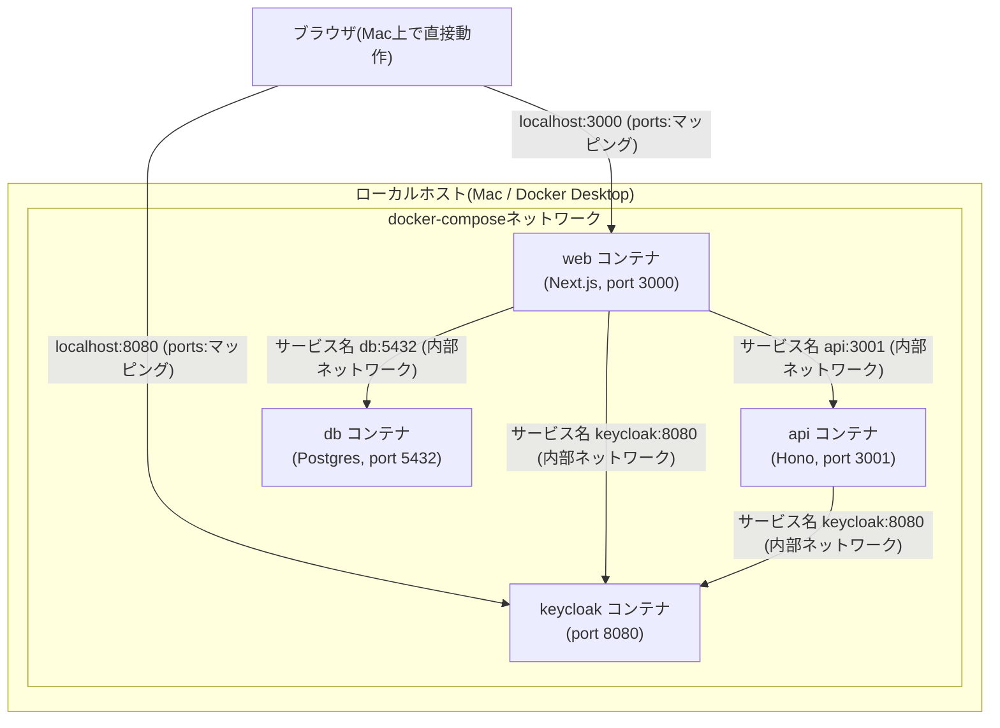
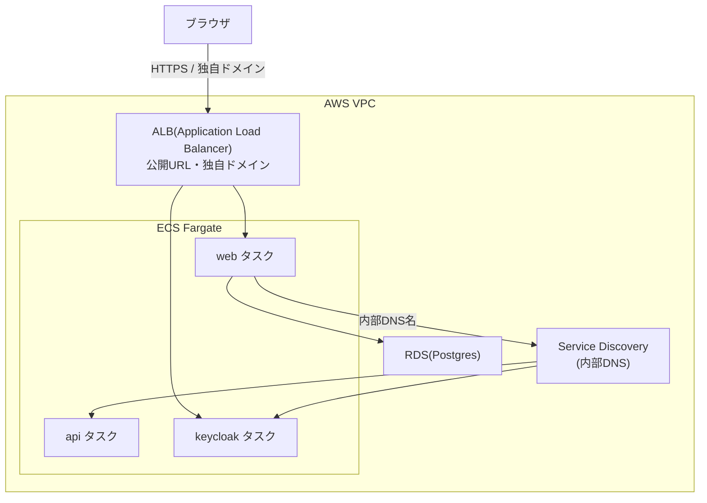

# Dockerコンテナの基礎とネットワーキング

コンテナ・イメージ・ビルドの基本概念と、ローカル(docker-compose)と本番(ECS)でネットワークの繋がり方がどう変わるかを整理する。

## コンテナとイメージ

- **イメージ**: コンテナの中身になるファイル一式のスナップショット(いわば設計図・材料)
- **コンテナ**: イメージから実際に起動された、動いているインスタンス
- **`docker build`**: イメージを作る(まだ何も起動しない)
- **`docker run` / `docker compose up`**: イメージから実際にコンテナを起動する

イメージを作っただけでは何も動いていない。「起動する」には別途コマンドが必要、という点は混同しやすいので注意。

コンテナは、独立したOS(カーネル)を持っているわけではない。ホストマシンのカーネルを共有しながら、Linuxのnamespace・cgroupという機能で「自分専用のプロセス空間・ファイルシステム・ネットワーク」を持っているように隔離している。体感としては「それぞれが独立したLinux環境でサービスを動かしている」という理解で実用上問題ない。

## ビルドの仕組み

### ビルドコンテキスト

`docker build`には、Dockerfileとは別に「Dockerがアクセスできるファイルの範囲」を指定する必要がある。これをビルドコンテキストと呼ぶ。Dockerfile内の`COPY`命令は、このコンテキストの中からしかファイルを取得できない。

```
docker build -f apps/web/Dockerfile -t sample-app-web .
```

- `-f`: Dockerfileの場所
- 最後の`.`: ビルドコンテキスト(コマンドを実行したディレクトリ)

モノレポの場合、`COPY . .`でモノレポ全体(他のapp/packages含む)にアクセスする必要があることが多いため、ビルドコンテキストは通常**リポジトリのルート**にする。

### レイヤーとキャッシュ

Dockerfileの各命令(`FROM`, `RUN`, `COPY`など)は、実行されるたびに「レイヤー」という差分を1つ作る。同じ命令・同じ入力であればDockerはキャッシュを再利用するが、**あるレイヤーが変わると、それ以降の全レイヤーが作り直しになる**。

この性質を利用し、依存関係の定義(`package.json`)だけを先にコピーして`pnpm install`し、その後にソースコード全体をコピーするという順序にすると、「ソースだけ変更した場合、installの結果はキャッシュを再利用できる」という高速化ができる。

### マルチステージビルド

1つのDockerfileの中に`FROM ... AS 名前`を複数回書くと、それぞれ独立した「ステージ」になる。`COPY --from=<ステージ名>`で、あるステージの成果物だけを別のステージに持ち込める。

`docker build`はデフォルトで**最後のステージだけ**を最終イメージとして出力する。これを利用し、「ビルド作業は太った環境(ソース全体、開発ツール)で自由にやり、実際に配布するイメージには、実行に必要な成果物だけを残す」という構成にできる。

今回のNext.js(`apps/web`)の例:

| ステージ | 役割 | 最終イメージに含まれるか |
|---|---|---|
| `base` | 共通の出発点(Node.js + pnpm) | 土台として使われるのみ |
| `pruner` | モノレポ全体から、対象app(`web`)に必要な部分だけを`turbo prune`で切り出す | 含まれない |
| `builder` | 切り出された分だけを対象に、依存関係インストール+ビルド | 含まれない |
| `runner` | ビルド済みの成果物だけをコピーした、実行専用の最終イメージ | **これが最終イメージ** |

### `turbo prune`

モノレポ全体の依存関係グラフを使い、「指定したapp(例: `web`)が実際に必要としているパッケージだけ」を抜き出すコマンド。無関係な他のapp(例: `api`)は除外される。`--docker`オプションを付けると、出力が`out/json/`(`package.json`・lockfileだけ)と`out/full/`(実際のソース込み)に分割され、上記のレイヤーキャッシュの最適化に使える。

### ビルド時に必要な環境変数(`ARG`/`ENV`)

フレームワークによっては、ビルド中に実際にコードが評価される(Next.jsの`next build`はルートを解析するためにモジュールを実行する)。このとき環境変数を参照するコードがあると、ビルド時点でその変数が必要になる。`ARG`(ビルド時だけ使える変数)と`ENV`(実際にプロセスの環境変数として設定)を使い、ビルド専用のダミー値を渡す。本物の値は、後述するコンテナ**起動時**に別途上書きする。

なお、Turborepoはデフォルトで「厳格モード」で動作し、`turbo.json`のタスク定義に`env`として明示した環境変数しかタスクに渡さない。ビルド時に必要な環境変数は、Dockerfileだけでなく`turbo.json`側にも登録しておく必要がある。

## ローカル環境でのネットワーキング



**ポイント:**
- `ports: "8080:8080"`のような設定は、「ホストのポート」と「コンテナ内部のポート」を繋ぐブリッジ。**外の世界(ブラウザ、ホストマシン)からコンテナに入るための入り口**
- コンテナ同士(`web`→`keycloak`など)の通信には`ports:`は関係ない。同じdocker-composeネットワークに参加していれば、**サービス名をホスト名として直接通信できる**
- コンテナの中から見た`localhost`は、**そのコンテナ自身**を指す。ホストや他のコンテナを指さない点に注意(これが、ブラウザ向けURLとコンテナ間通信用URLを使い分ける必要がある根本原因)

## 本番(ECS)でのネットワーキングの違い



**ローカルとの違い:**
- Fargateでは「1台のホストマシンを自分たちで用意・管理する」という概念が無い。各タスク(コンテナ)は、AWSが裏側で管理する、見えないマシン上で動く。`web`・`api`・`keycloak`が同じマシン上にいるとは限らない
- **ブラウザから使うもの**は、`ports:`のようなホストのポートマッピングではなく、**ALB(ロードバランサー)**が窓口になる。ALBが固定のURL(将来的には独自ドメイン)を持ち、その時々で動いているタスクにリクエストを振り分ける
- **コンテナ同士の内部通信**は、**Service Discovery**(AWS Cloud Mapなどによる内部DNS)を使い、名前でお互いを見つけ合う。「同じホストのポートを共有する」という発想はここでは使わない

**今回のローカル対応との対応関係:**

| ローカル(docker-compose) | 本番(ECS) |
|---|---|
| ブラウザ向けURL: `localhost:8080`(ports:マッピング経由) | ブラウザ向けURL: ALBの公開URL/独自ドメイン |
| コンテナ間通信向けURL: `keycloak:8080`(サービス名) | コンテナ間通信向けURL: Service Discoveryの内部DNS名 |

今回`KEYCLOAK_ISSUER`(内部向け)と`KEYCLOAK_ISSUER_PUBLIC`(ブラウザ向け)を分けて設計しているのは、ローカルの都合だけでなく、**本番でも同じ「内部向け/外部向けを分ける」という設計思想がそのまま活きる**ようにするため。

## まとめ

- イメージを作る(`docker build`)ことと、コンテナを起動する(`docker run`)ことは別の作業
- マルチステージビルドは「ビルド専用の作業場」と「実際に配布する最終成果物」を分離するための仕組み
- `ports:`はホスト↔コンテナの入り口、サービス名はコンテナ同士の内部通信という、2つの別々の繋がり方がある
- コンテナの中から見た`localhost`は自分自身を指すため、ブラウザ向けとコンテナ間通信向けでURLを使い分ける必要がある
- ローカルの「1台のホストにポートを繋げる」という構成は開発を簡単にするための特殊なケースであり、本番(ECS Fargate)ではALB・Service Discoveryという別の仕組みに置き換わる
